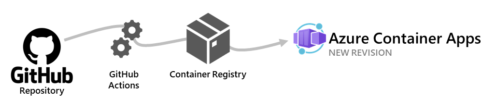

# Challenge 10 - Implementing CI/CD with GitHub Actions

## Introduction
To achieve agile development, it is essential to automate your builds and deployments. In this challenge, you will create a GitHub Actions workflow that automatically builds and deploys your container app upon code changes.

Azure Container Apps allows you to use GitHub Actions to publish revisions to your container app. As commits are pushed to your GitHub repository, a workflow is triggered which updates the container image in the container registry. Azure Container Apps creates a new revision based on the updated container image.

## Description
- Create a GitHub Actions workflow file in your repository.
- Configure the workflow to build your container image and deploy it to Azure Container Apps.
- Test the workflow by pushing a code change and verifying a new deployment.

## Success Criteria
- A GitHub Actions pipeline is established.
- Code changes automatically trigger a build and deployment.
- The container app updates seamlessly based on the CI/CD process.

## Learning Resources
- [GitHub Actions for Azure Container Apps](https://learn.microsoft.com/en-us/azure/container-apps/github-actions)
- [Introduction to GitHub Actions](https://docs.github.com/en/actions/learn-github-actions/introduction-to-github-actions)
- [Azure Container Apps Build and Deploy action](https://github.com/marketplace/actions/azure-container-apps-build-and-deploy)